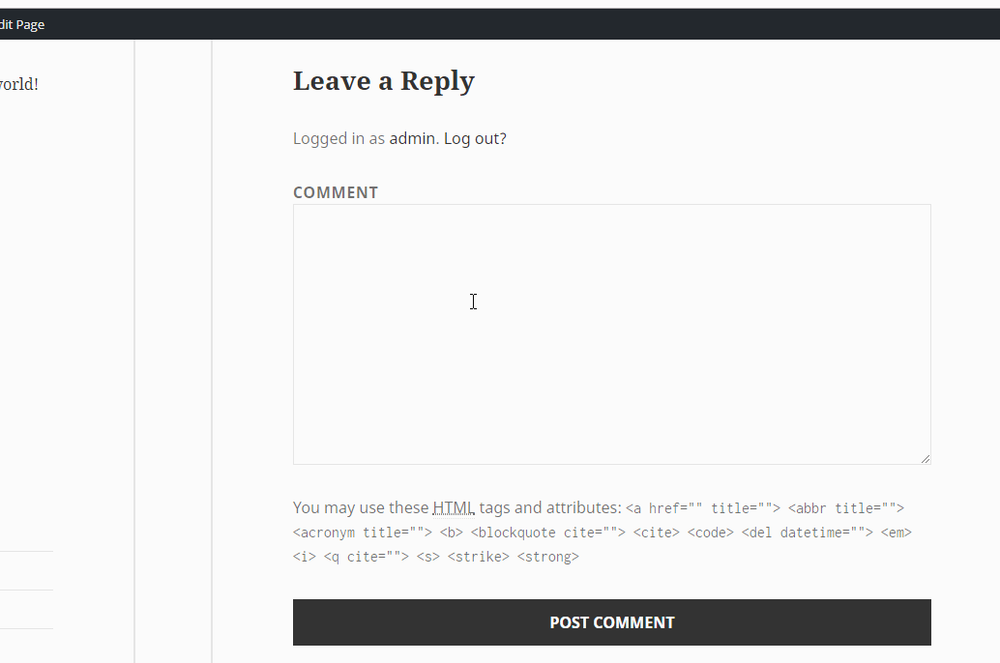
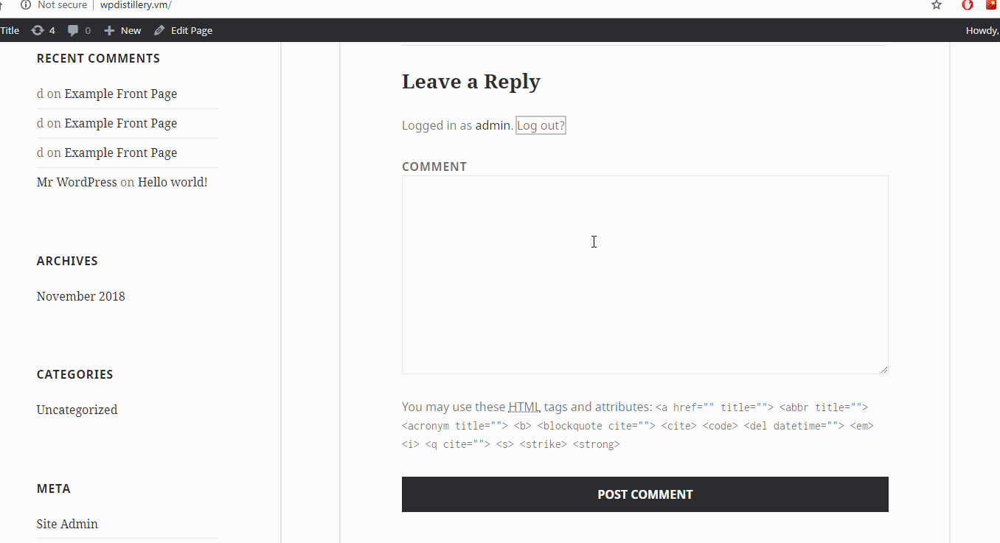
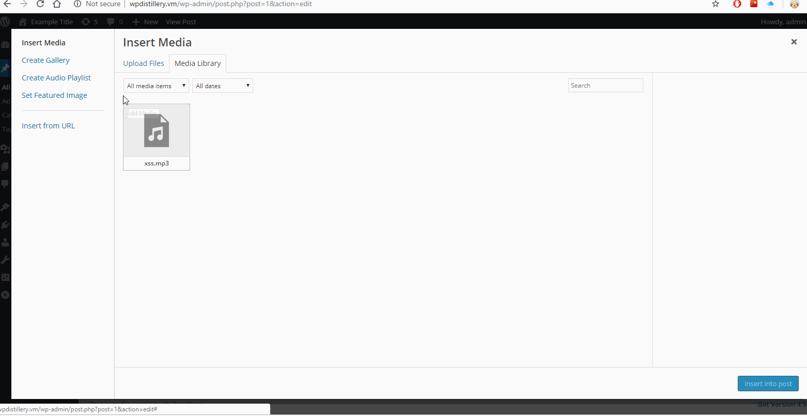

Project 7 - WordPress Pentesting

Time spent: 3 hours spent in total

> Objective: Find, analyze, recreate, and document **three vulnerabilities** affecting an old version of WordPress

1. Authenticated Stored Cross-Site Scripting - CVE-2015-5622

Summary: Cross-site scripting (XSS) vulnerability in WordPress before 4.2.3 allows remote authenticated users to inject arbitrary web script or HTML by leveraging the Author or Contributor role to place a crafted shortcode inside an HTML element, related to wp-includes/kses.php and wp-includes/shortcodes.php.
  Vulnerability: XSS
  Version: 4.2
  Fixed: 4.2.3

To Recreate:
  1. Have Wordpress 4.2
  2. log in to account so you can post a comment
  3. when typing a comment, insert your javascript injection in the comment before what you want the comment to say
  4. Post comment, js will run every time pasge is loaded as long as comment exists
  
2. Unauthenticated Stored Cross-Site Scripting - CVE-2015-3440

Summary: An unauthenticated attacker can inject JavaScript in WordPress comments. The script is triggered when the comment is viewed.
  Vulnerability: XSS
  Version: 4.2
  Fixed: 4.2.1

To Recreate:
  1. Have Wordpress 4.2, must be signed out
  2. when typing a comment, insert your javascript injection in the comment before what you want the comment to say
  3. Post comment, js will run every time pasge is loaded or hovered on as long as comment exists
  
3. Authenticated Cross-Site Scripting (XSS) via Media File Metadata - CVE-2017-6814

Summary: An unauthenticated attacker can inject JavaScript in WordPress comments. The script is triggered when the comment is viewed.
  Vulnerability: XSS
  Version: 4.2
  Fixed: 4.2.13

To Recreate:
  1. Have Wordpress 4.2
  2. When adding a post, click on add media button
  3. click create audio playlist
  4. add any audio file, add your javascript to the description of the file
  5. javascript will trigger when you create the audio playlist

## Resources

- [WordPress Source Browser](https://core.trac.wordpress.org/browser/)
- [WordPress Developer Reference](https://developer.wordpress.org/reference/)

GIFs created with [LiceCap](http://www.cockos.com/licecap/).

## License

    Copyright [2018] [Matthew DeGroff]

    Licensed under the Apache License, Version 2.0 (the "License");
    you may not use this file except in compliance with the License.
    You may obtain a copy of the License at

        http://www.apache.org/licenses/LICENSE-2.0

    Unless required by applicable law or agreed to in writing, software
    distributed under the License is distributed on an "AS IS" BASIS,
    WITHOUT WARRANTIES OR CONDITIONS OF ANY KIND, either express or implied.
    See the License for the specific language governing permissions and
    limitations under the License.
